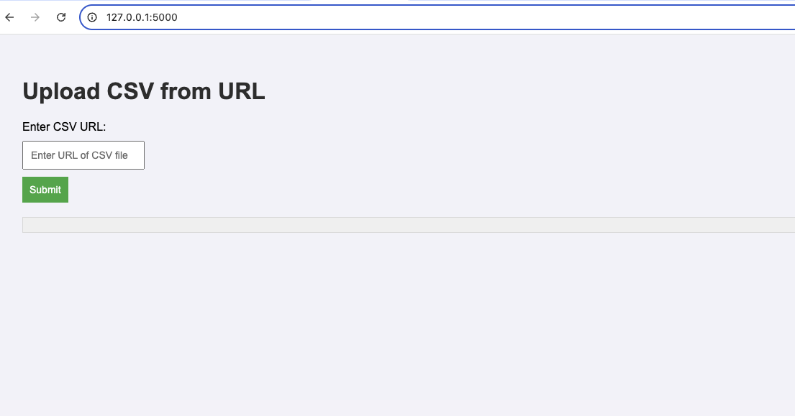
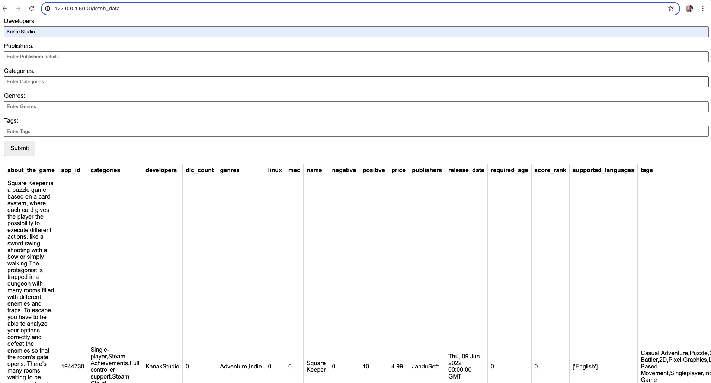

# assignments

# Segwise: CSV Upload and Data Filtering Application

## Overview
Segwise is a Flask-based application designed for uploading CSV files and filtering data interactively or via API calls. This guide provides step-by-step instructions to set up and run the application.

---

## Getting Started

### Clone the Repository
```bash
git clone https://github.com/im-ray/assignments.git
```

### Navigate to the Project Directory
```bash
cd segwise
```

---

## Setup Instructions

### Local Setup
1. Install required dependencies:
   ```bash
   pip install -r flask_req.txt
   ```
   > **Note:** Ensure you are using Python 3.9.

2. Pull the PostgreSQL Docker image:
   ```bash
   docker pull postgres:latest
   ```

3. Start a PostgreSQL container:
   ```bash
   docker run -d \
     --name postgres_container \
     -e POSTGRES_USER=postgres \
     -e POSTGRES_PASSWORD=postgres \
     -e POSTGRES_DB=analytics \
     -p 5432:5432 \
     postgres:latest
   ```

---

## Running the Application
Start the Flask application:
```bash
python run.py
```

Once the application is running, navigate to:
- [http://127.0.0.1:5000/](http://127.0.0.1:5000/) for CSV upload functionality.
- [http://127.0.0.1:5000/fetch_data](http://127.0.0.1:5000/fetch_data) for interactive data filtering.

---

## Usage

### Upload CSV via Terminal (cURL Example)
You can upload a CSV file by providing a valid `csv_url` parameter. Run the following command:

```bash
curl -X POST -H "Content-Type: application/json" \
  -d '{"csv_url": "https://example.com/your_csv_file.csv"}' \
  http://127.0.0.1:5000/upload_csv_url
```

### Filter Data
#### Interactive UI:
Navigate to:
[http://127.0.0.1:5000/fetch_data](http://127.0.0.1:5000/fetch_data)

You can use the provided interface to pass values for filtering the data.

#### Terminal (cURL Example):
Provide filtering parameters via a POST request (replace `<parameter>` with actual values).

---

## Screenshots




---

## Notes
- Ensure Docker is installed and running on your machine.
- The PostgreSQL container must be running before starting the Flask application.


### Docker container Setup
## Running with Docker

### Build the Docker Image
1. Ensure Docker is installed and running on your machine.
2. Build the Docker image from the project directory:
   ```
      docker build --no-cache -t segwise-app -f Dockerfile .
   ```
3. Start a container from the built image:
```
docker run -d -p 5000:5000 --name segwise_container segwise-app
```
4. The application will now be accessible at:
http://127.0.0.1:5000/ for the upload CSV functionalities.
http://127.0.0.1:5000/fetch_data for the interactive UI for data explorer.


#### 1. upload_csv endpoint
The upload_csv API allows users to easily upload datasets stored in CSV files by providing a direct link to a publicly accessible CSV file. This API automates the process of importing data, parsing it, and storing it in a database, saving time and reducing manual effort for data analysts.


Q1 : why clickhouse (column based ) not postgres(row based) ?
https://posthog.com/blog/clickhouse-vs-postgres


setup clickhouse in docker
https://www.propeldata.com/blog/clickhouse-docker

https://medium.com/@jayprakash.bilgaye/getting-started-with-clickhouse-on-docker-quick-and-easy-guide-for-mac-users-e69dcc138c6e

```
    docker pull clickhouse/clickhouse-server
```

```
    docker run -d --name segwise_clickhouse -p 8123:8123 -p 9000:9000 -e CLICKHOUSE_USER=rupesh -e CLICKHOUSE_PASSWORD=Rupesh123 -e CLICKHOUSE_DEFAULT_ACCESS_MANAGEMENT=1 clickhouse/clickhouse-server:latest
```


# Segwise AI - Backend Assignment

## Overview

This project is a backend application built using **Flask** and **ClickHouse**. The purpose of this application is to handle CSV file uploads, process them, and store the data into **ClickHouse**.

### Database Setup:
1. **ClickHouse** Database and Table are set up and initialized successfully when the app starts.
2. The **ClickHouse schema** is created with the following structure:

   ```sql
   CREATE DATABASE IF NOT EXISTS analytics;

   CREATE TABLE IF NOT EXISTS analytics.game_data (
       app_id Int64,
       name String,
       release_date DateTime,
       required_age Int64,
       price Float64,
       dlc_count Int64,
       about_the_game String,
       supported_languages String,
       windows UInt8,
       mac UInt8,
       linux UInt8,
       positive Int64,
       negative Int64,
       score_rank Float64,
       developers String,
       publishers String,
       categories String,
       genres String,
       tags String
   ) ENGINE = MergeTree()
   ORDER BY release_date;

### Testing with local csv file once the server is up and running
***(Make sure database is up and running before this setup, here i am running in docker)***
command to run the application and test with local csv file from the project directory

```
python run.py
```

```
curl -X POST -F "file=@game_data.csv" http://127.0.0.1:5000/upload_csv
```


